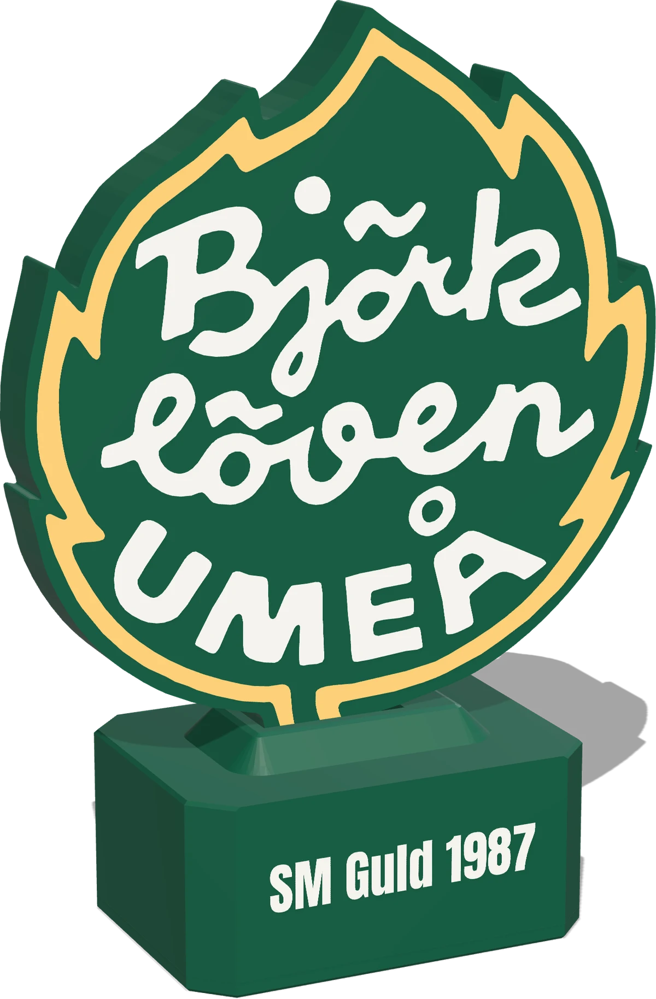
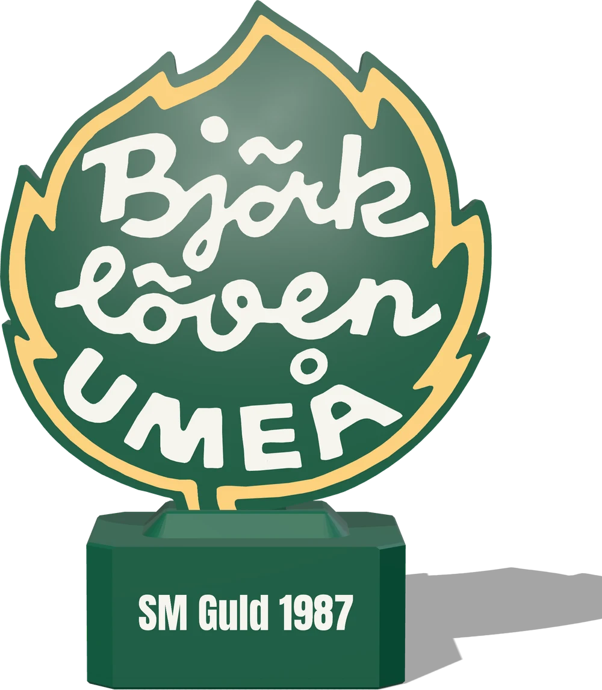
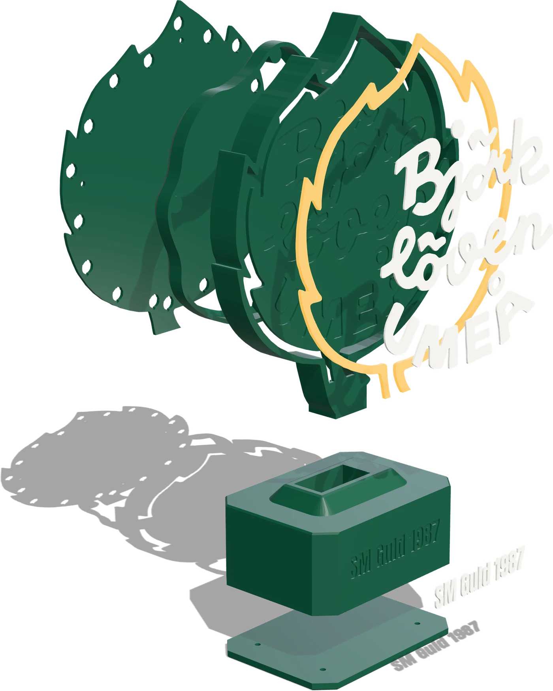
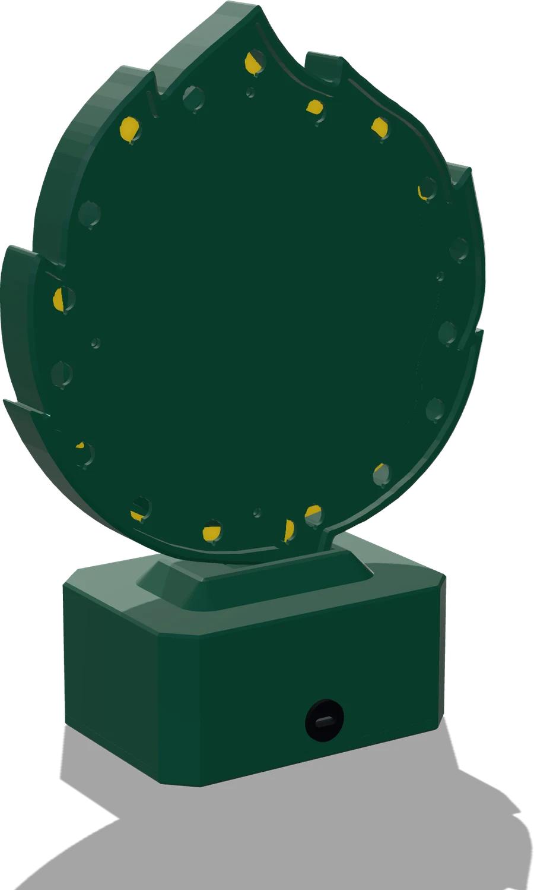

# LövGlöd 🍃

**Lövet som följer Löven.** Det glöder lugnt en vanlig tisdag, vaknar när
pucken släpps och exploderar när Björklöven gör mål.



LövGlöd är en 3D-utskriven lampa i form av Björklövens löv, 25 cm hög, med en
ESP32 och en adresserbar LED-list bakom klubbmärkets gula band. Den läser
spelschemat och live-ställningen direkt från SHL och visar matchen i ljus. Du
behöver aldrig röra den.

- **Följer varje match.** Spelschema och mål direkt från SHL:s publika API.
  Inga appar, inga konton, ingen mellanserver.
- **Tolv sekunders mål.** Stroboskop och kometer ut från lövets mitt, fördröjt
  så att tv-sändningen hinner ikapp och ingen i rummet får målet avslöjat.
- **Sköter sig själv.** Koppla in med USB-C, ställ in med mobilen. Uppdaterar
  sig över WiFi med signerad firmware.
- **Öppen hela vägen.** Modellerna, byggbeskrivningen och koden ligger här.
  Åtta timmars utskrift, en halvtimmes montering och några lödpunkter.

---

## Ljusspråket

Lampan har ett litet, fast ordförråd. Grönt och gult är lagets färger, rött
betyder att något står i vägen.

| Läge | Ljus |
|---|---|
| **Glöd** | Vardag. Ett långsamt gult andetag på sju sekunder, med organisk variation längs listen. |
| **Vann igår** | Vita gnistor ovanpå glöden, fram till midnatt. |
| **Match pågår** | Glöden drar åt bärnsten och andas dubbelt så fort. |
| **MÅL** | Tolv sekunder stroboskop och kometer. |
| **Uppdaterar** | En gul stapel som fylls med nedladdningen. |
| **Setup** | Grön puls — anslut med mobilen. |
| **Ingen data** | Svagt rött andetag — SHL svarar inte. |

Varje läge, och varför det ser ut som det gör, finns i
[Ljusspråket →](docs/GLODEN.md)

---

## Formgiven in i detalj

<p>
  
  
  
</p>

- **Färgen sitter i ytan.** Det gula bandet och texten är inlagda i
  flerfärgsutskriften, inte målade. Framsidan är helt plan.
- **Jämnt ljus runt om.** LED-listen står på högkant och lyser från sidan in i
  bandet, så det glöder jämnt utan synliga prickar.
- **Inga synliga skruvar.** Elektroniken bor i sockeln. Framifrån syns bara
  lövet och *SM Guld 1987*.

| | |
|---|---|
| Mått (b × d × h) | 182,6 × 84 × 250,5 mm |
| Material | PLA i grönt, vitt och transparent gult, 307 g |
| Ljus | WS2812B eller APA102, 5 V, ~55 cm |
| Styrenhet | ESP32 med WiFi (2,4 GHz) |
| Ström | USB-C i sockelns baksida, 5 V / 3 A |
| Matchdata | SHL:s publika API, live via SSE |
| Uppdateringar | Automatiska över WiFi, RSA-signerade, med stabil- och betakanal |
| Inställningar | Statussida i webbläsaren: ljusstyrka, tv-fördröjning, testa målet |

---

## Så fungerar det

```
  SHL:s API ──► ESP32 ──► LED-list bakom det gula bandet
  (schema,       │
   SSE live)     ├──► statussida på http://bjorkloven-led.local
                 │
  GitHub ────────┘    signerad firmware, kollas var 12:e timme
  Releases
```

Lampan håller koll på nästa match. När matchfönstret öppnas kopplar den upp mot
SHL:s live-ström och pollar dessutom dagens matcher som skyddsnät. Ett mål
läggs i kö, väntar ut din tv-fördröjning och tänder fyrverkeriet. Dagen efter en
vinst glittrar glöden.

---

## Bygg din egen

Fyra guider, i den ordning du troligen behöver dem:

| | Guide | Innehåll |
|---|---|---|
| 🖨️ | [**Montera**](docs/MONTERA.md) | Skriva ut de tre plattorna, inköpslista, montering steg för steg och kopplingen |
| 💾 | [**Installera firmwaren**](docs/INSTALLERA.md) | Flasha en färdig release över USB, första start med mobilen, uppdateringar och betakanalen |
| 💡 | [**Ljusspråket**](docs/GLODEN.md) | Varje läge på listen i detalj, justera glöden och ställa in tv-fördröjningen |
| 🛠️ | [**Bygga projektet**](docs/BYGGA.md) | PlatformIO, kopplingstest, mockserver för labbtest, releaser och signering, SHL-API:t |

Kostnaden per lampa är räknad i [KALKYL.md](KALKYL.md).

---

## Licens

- **Firmware och verktyg** — [MIT](LICENSE).
- **3D-modeller, byggguide och webbplats** (`hardware/`, `docs/MONTERA.md`,
  `site/`) — [CC BY-SA 4.0](hardware/LICENSE).

IF Björklövens namn, klubbmärke och övriga varumärken omfattas inte av någon av
licenserna. De tillhör IF Björklöven. Projektet är inte knutet till eller godkänt av
klubben.
